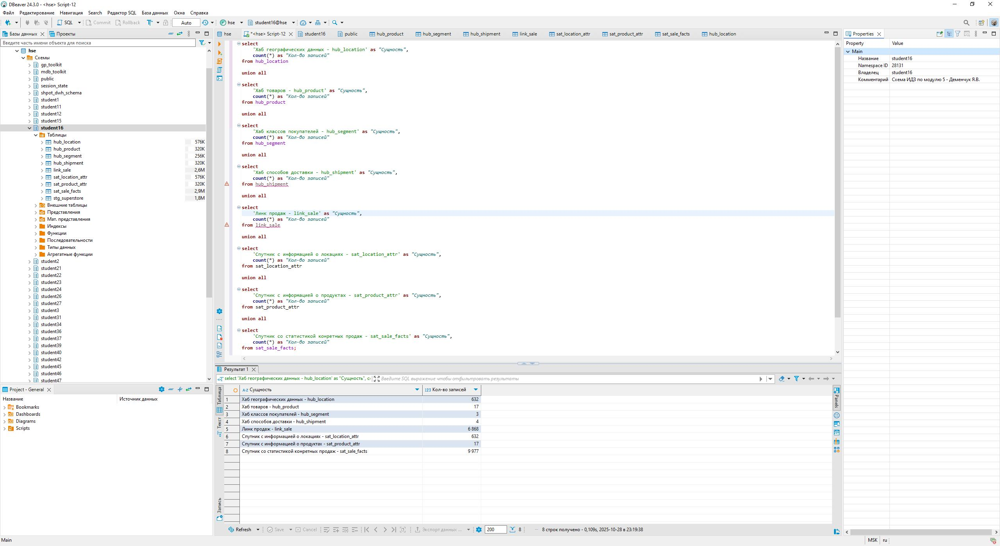

# Итого задание по модулю 5 - Курс "Системы Хранения Данных"

## 🧩 Описание

Проект демонстрирует реализацию **архитектуры Data Vault 2.0** для аналитической модели на основе открытого набора данных **SampleSuperstore.csv**.  

---

## 📁 Структура проекта

| Каталог / Файл | Назначение |
|----------------|------------|
| `SampleSuperstore.csv` | Исходный CSV-файл с данными о продажах, доставке и товарах |
| `DataVault_diagram.png` | Графическое представление схемы |
| `data_check.png` | Проверка загрзуки данных в DataVualt |
| `sql/DataVault_structure.sql` | DDL-скрипт для создания всех таблиц Data Vault |
| `sql/load_hub_shipment` | DDM-скрипт для загрузка stage → HUB_SHIPMENT |
| `sql/load_hub_segment` | DDM-скрипт для загрузка stage → HUB_SEGMEN|
| `sql/load_hub_location` | DDM-скрипт для загрузка stage → HUB_LOCATION |
| `sql/load_hub_product` | DDM-скрипт для загрузка stage → HUB_PRODUCT |
| `sql/load_link_sale` | DDM-скрипт для загрузка stage → LINK_SALE |
| `sql/load_sat_product_attr` | DDM-скрипт для загрузка stage → SAT_PRODUCT_ATTR |
| `sql/load_sat_location_attr` | DDM-скрипт для загрузка stage → SAT_LOCATION_ATTR |
| `sql/load_sat_sale_facts` | DDM-скрипт для загрузка stage → SAT_SALE_FACTS |
| `README.md` | Документация проекта |

---

## 📄 Исходный файл `SampleSuperstore.csv`

**Структура полей:**

| Категория | Поля | Описание |
|------------|------|-----------|
| **Shipment** | Ship Mode | Способ доставки |
| **Customer Class** | Segment | Сегмент клиента |
| **Location** | Country, City, State, Postal Code, Region | Географическая информация |
| **Product** | Category, Sub-Category | Категория и подкатегория товара |
| **Stats** | Sales, Quantity, Discount, Profit | Метрики продаж |

---

## 🧱 Архитектура Data Vault

### 🏗️ Основные сущности

#### **Хабы**
| Хаб | Бизнес-ключ | Назначение |
|-----|--------------|------------|
| `HUB_SHIPMENT` | Ship Mode | Способы доставки |
| `HUB_SEGMENT` | Segment | Сегменты клиентов |
| `HUB_LOCATION` | Country + City + Postal Code | Географическая зона |
| `HUB_PRODUCT` | Category + Sub-Category | Категории товаров |

#### **Линк**
| Линк | Соединяет | Назначение |
|------|------------|------------|
| `LINK_SALE` | Shipment + Segment + Location + Product | Контекст продажи (факт связывания всех хабов) |

#### **Спутники**
| Спутник | Привязан к | Содержит | Комментарий |
|----------|-------------|-----------|-------------|
| `SAT_PRODUCT_ATTR` | HUB_PRODUCT | Category, Sub-Category | Атрибуты товара |
| `SAT_LOCATION_ATTR` | HUB_LOCATION | Country, State, City, Region, Postal Code | Географические атрибуты |
| `SAT_SALE_FACTS` | LINK_SALE | Sales, Quantity, Discount, Profit | Фактические показатели продаж |

## ⚙️ Технические особенности

- **Хэширование:** `MD5()`  
  - Для бизнес-ключей (Hub Keys, Link Keys)  
  - Для вычисления `hashdiff` в спутниках
- **PK в спутниках:** `(business_hashkey, hashdiff)`  
  - обеспечивает уникальность по ключу и содержимому без зависимости от `loaddate`
- **Атрибуты метаданных:**
  - `loaddate` — дата и время загрузки записи  
  - `recordsource` — источник данных (`'CSV_SUPERSTORE'`)

 ---
 
## 🔄 Процесс загрузки данных

### 1️⃣ Создание и заполнение stage-таблицы

Stage-таблица служит промежуточным слоем между исходным CSV-файлом и моделью Data Vault.  
Она повторяет структуру исходных данных без хэш-ключей и используется для стандартизации и очистки перед загрузкой в хабы, линки и спутники.

**Шаги:**
1. Создаём таблицу c помощью DDL-скрипта srg_superstor.sql
2. Загрузите данные из CSV через DBeaver:
    ПКМ → Импорт данных → CSV → stg_superstore (Формат: CSV, разделитель ",", кодировка UTF-8, наличие заголовков ✅)

### 2️⃣ Загрузка данных в хабы (HUB)

На этом шаге используем DDM-скрипты load_hub_product.sql, load_hub_location.sql, load_hub_segment.sql, load_hub_shipment.sql, чтобы данные из stage-таблицы преобразовать в хэш-ключи MD5 и загрузить в таблицы HUB_PRODUCT, HUB_LOCATION, HUB_SEGMENT, HUB_SHIPMENT.

### 3️⃣ Загрузка данных в линки (LINK)

Таблица LINK_SALE соединяет все хабы и формирует “факт” продажи.
Хэш-ключ линка строится из комбинации хэш-ключей всех участвующих хабов.
На этом этапе создаются связи между продуктом, локацией, сегментом и типом доставки c помощью DDM-скрипта load_link_sale.sql

### 4️⃣ Загрузка данных в спутники (SATELLITE)

Спутники содержат описательные и фактологические атрибуты.
Для каждого спутника вычисляется HashDiff — хэш от всех атрибутов, что позволяет контролировать изменения (SCD Type 2).
Для заполнения соответсвующих таблиц исползуются следующие DDM-скрипты: load_sat_location_attr.sql, load_sat_product_attr.sql, load_sat_sale_facts.sql

### 5️⃣ Проверка результатов

